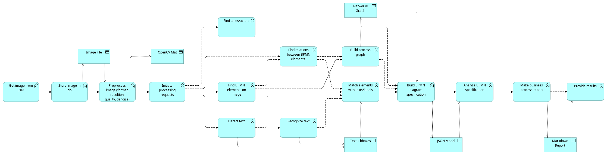
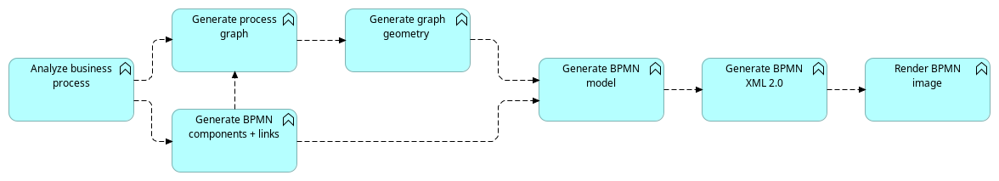

# Overview

Система решает задачи:

- составления текстового описания BPMN диаграмм и XML спецификаций по изображению диаграммы в графическом формате.
- составления XML спецификации и создания графического изображения BPMN диаграмм по текстовому описанию.

# Tech Stack

- Python 3.12
- Развертывание в Docker
    - Отдельные контейнеры под сервисы взаимодействия с пользованием, задачи CV, инференса LLM, и т.д.
- REST API: FastAPI
    - Простой сервер для ручек отправки задачи и проверки статуса
- Front: Gradio
    - В рамках ограниченного времени - лучший вариант для развертывания user-friendly сервиса
- Контроль высокоуровневых задач, хранение запросов: Redis
- Хранение изображений: Minio
- Обработка изображений: OpenCV
- Платформа решения: Ray
    - построения распределенной асинхронной микросервисной архитектуры
    - очереди задач, передача данных между сервисами, хранение данных
    - инференс LLM
- По поводу технологий, которыми решаются отдельные задачи - см. далее "Roadmap & decisions"

# Hardware

- Задачи на CPU:
    - веб сервер
    - предобработка изображений (очистка, повышение качества)
    - распознавание текста \ OCR
    - распознавание компонентов диаграмм
    - распознавание соединений компонентов диаграмм
    - составление графов по распознанному и преобразование графов в BPMN XML и JSON
- Задачи на GPU
    - инференс LLM для задачи составления текстового описания по графу диаграммы и наоборот
- Решение может развертываться на одной или более нодах, минимум одна из которых с GPU

Для тестов будем использовать машину с Intel Ultra9 и RTX 4060 8G

# Architecture

## Прямой процесс:

- CV-предобработка изображения
- Детекция текста, объектов и связей раздельными задачами
- Распознавание текста
- Классификация объектов
- Мэтчинг объектов с текстами, связей с объектами, подписей со связями и построенние графа
- Валидация графа, построение упрощенного описания BPMN-модели в JSON
- LLM-обработка JSON модели для получения саммари по процессу

На схеме представлен полный процесс обработки изображения.

Все представленные на схеме компоненты обработки изображения являются отдельными сервисами и передают данные между собой
через очереди ray.

## Обратный процесс:

- LLM-обработка текста описания процесса для преобразования в JSON модель описания компонентов и связей BPMN
    - использование 2х-агентного процесса генерации/критики, модель маленькая и тупая, поэтому ее точно нужно валидировать
- Построение графа процесса и валидация графа
- Размещение графа на плоскости, построение геометрии схемы
- Генерация BPMN XML по стандарту
- Рендер схемы

# Roadmap & decisions

1. Сбор датасета

- Статус: ✅ DONE
- Описание:
    - Собран аннотированный датасет на 1100 троек: изображение, BPMN XML, описание и граф процесса в JSON
    - Автоматизирован рендер диаграмм
    - Автоматизировано построение описаний по XML

2. Архитектура решения и основная система

- Статус: ✅ DONE

3. Проработка процесса распознавания диаграмм

- Статус: ✅ DONE
- Описание:
    - Проверено применение разных подходов к распознаванию структуры: VLM, VQA, классическое CV
    - Определено, что применение VLM дает отличный результат и позволяет решить задачу
      в одно действие, но совершенно не подходит для промышленного применения, так как обработка одного изображения
      занимает не менее 10 с, и графическая карта в этот момент монополизирована расчетами для единственного
      изображения,
      так что данный вариант очень плохо масштабируется (когда нет денег)
    - Пришли к выводу, что нужно разделить задачу на несколько подзадач, которые хорошо решаются на CPU
    - Установили цель достичь не более 1с на обработку изображения и не более 4с на работу LLM

4. Решение распознавания текста

- Статус: ✅ DONE
- Описание:
    - Проведены тесты разных подходов к OCR: классика, современные специализированные OCR модели, VLM
    - Проведена визуальная оценка качества на множестве изображений с руччким текстом
    - Выбран EasyOCR как лучший одновременно по критериям производительности и точности распознавания,
      при этом хорошо работает на CPU
    - Сервис готов ✅

5. Решение детекции и классификации элементов диаграмм

- Статус: ✅ DONE
- Описание:
    - Были проверены варианты:
        - VLM
            - работает очень долго (от 10с до 2мин в зависимости от модели)
            - есть проблемы по качеству определения координат и с потерянными связями
            - идеально распознаются текста и классифицируются типы
        - Поиск элементов с помощью кластеризации контурных точек
            - работает 1-2с
            - сшивает близкие элементы и игнорирует пустые внутри объекты
        - HOG + SVM
            - работает 1-2с
            - детекция с помощью скользящего окна
            - плохая скорость, точность и адаптируемость к разным изображениям
        - YOLOv8 nano
            - работает в пределах 50мс
            - дообучена на нашем датасете
            - acc=0.91
        - Выбрана YOLO, сервис готов ✅

6. Сервис по рендеру диаграм

- Статус: ✅ DONE
- Описание:
    - Сервис генерации валидных BPMN XML по внутренним графовым моделям
    - Сервис рендера готовых диаграф в изображения

7. Реализация сервиса распознавания связей

- Статус: 👷🏻 INPROGRESS
- Описание:
    - Проработаны варианты:
        - VLM - см. п.5
        - Детекция контуров по изображению с маскированными элементами
            - Точность очень низкая, путает стрелки и линии, ошибается на пересечениях
        - Дообучение YOLO для решения задачи pose estimation
            - Есть подтвержденный proof-of-concept
            - Идет дообучение, оценка качества и реализация сервиса

8. Решение по преобразованию описаний диаграмм

- Статус: 👷🏻 INPROGRESS
- Описание:
    - готовы модели данных для представления диаграм и графов
    - проработано использование xgrammar для вывода моделей из llm
    - готов proof-of-concept с отлаженными и отработанными промптами
    - Сейчас идет процесс бенчмарка моделей, чтобы определить оптимальное соотношение времени работы и точности

9. Решение по генерации графа

- Статус: 👷🏻 INPROGRESS
- Описание:
    - не-ML компонент для аггрегации данных в единую модель: объекты, связи, тексты
    - мэтчинг связей, мэтчинг подписей к объектам и связям
    - Есть proof-of-concept
    - Нужно собрать в сервис и протестировать совместно с детекторами

10. Расширение датасета

- Статус: 🔜 PLANNED
- Описание:
    - Расширить датасет описательной информацией о структуре процессов
    - Проведение end-to-end оценки качества всего процесса на датасете

11. Реализация сервиса предобработки

- Статус: 👷🏻 INPROGRESS
- Описание:
    - Было определено, что качество решения OCR задачи крайне сильно зависит от качества изображения
    - В процессе подготовка пайплайна адаптивной предобработки (преимущественно денойз и повышение четкости) методами
      не-ML CV

12. Реализация сервис генерации графа по описанию

- Статус: 🔜 PLANNED
- Описание:
    - соединить все микросервисы
    - определить способы масштабирования
    - максимально реализовать использование многопоточности и кластеризации

13. Реализация пайплайнов и соединение сервисов воедино

- Статус: 🔜 PLANNED
- Описание:
    - реализовать процесс с LLM для генерации JSON-моделей и графа процесса на основе текстового описания

14. Инференс LLM

- Статус: 🔜 PLANNED
- Описание:
    - Настроить инференс
    - Проверить раскатывание сервера на реальном оборудовании

15. Подготовка методов развертывания

- Статус: 🔜 PLANNED
- Описание:
    - Запаковать контейнеры
    - Сделать развертывание при помощи swarm или kuber, исходя из того, сколько останется времени

16. Реализация внешних интерфейсов

- Статус: 🔜 PLANNED
- Описание:
    - Сделать REST API
    - Сделать WEB UI
    - Подготовить системы наблюдаемости

17. Системное тестирование

- Статус: 🔜 PLANNED
- Описание:
    - Проверить работоспособность всего пайплайна
    - Провести бенчмарки по производительности
    - Провести оценку точности на датасете
